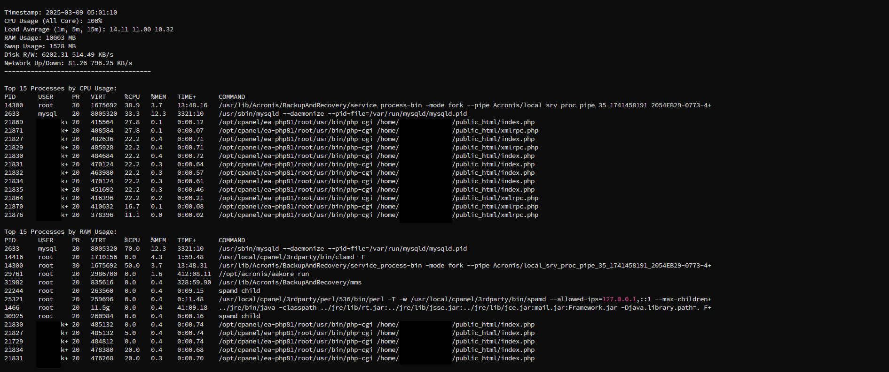
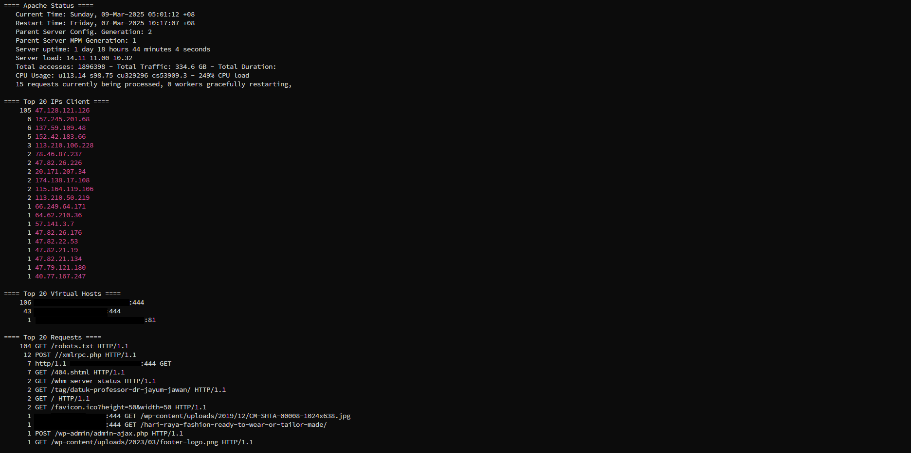
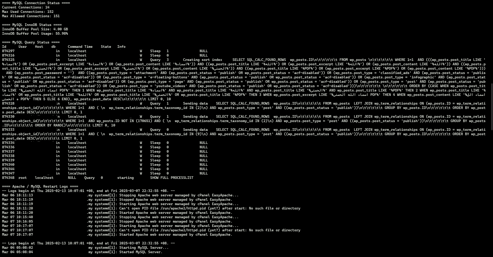

<h1 align="center">System Monitor</h1>

### About sys-mon:

Sys-mon is a simple system monitoring to check system process activity on RHEL-based Linux using the cPanel application. This tool will check every 60 seconds regarding CPU usage, average load, RAM usage, disk, and network activity. In addition, it will also check in detail which application processes use quite high CPU and RAM, total IPs that often access the web server, total virtual hosts that are often accessed, total requests that are often accessed, total database connection usage, innodb usage, and database query activity. In addition, the last log of apache and MySQL restart activity, disk I/O usage activity, and the last out-of-memory log will be displayed. 

#

### Pre-Requirement:

Compatible for CentOS/AlmaLinux with cPanel

Clone Repository:

- `git clone https://github.com/sideka-cloud/sys-mon.git && cd sys-mon`

#
### How to Install:

Install system_monitor: 

- `bash install.sh`

Check logs system_monitor, example:

- `bash read.sh "2025-03-07 22:00:00" "2025-03-07 22:10:00"`

Cek status service system_monitor:

- `systemctl status system_monitor`

Restart service system_monitor:

- `systemctl restart system_monitor`

Log directory:

- `/var/log/system_monitor`

#
### How to Un-install

Stop and disable service

- `systemctl stop system_monitor`
- `systemctl disable system_monitor`

Remove service and Remove logs

- `rm -rf /etc/systemd/system/system_monitor.service`
- `rm -rf /var/log/system_monitor`

#
### Example logs files:

